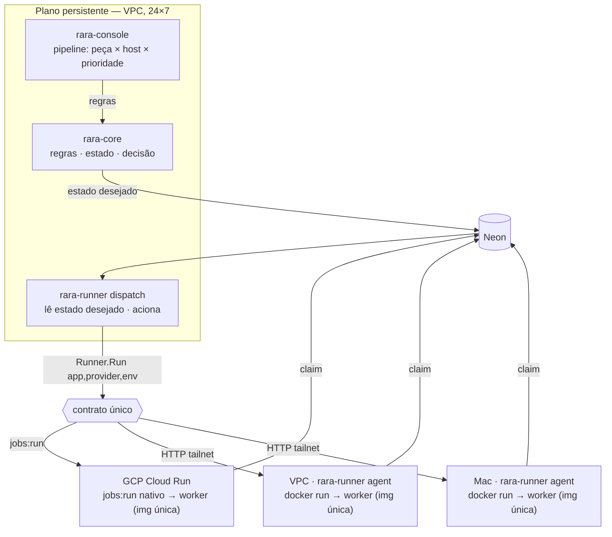

# rara 2.0 — Ativação unificada ("Cloud Run portátil")

Plano de design da próxima virada: tornar as **peças voláteis idênticas e acionáveis do mesmo jeito**
nos três hosts (GCP Cloud Run, VPC Oracle, Mac), por **um contrato único de ativação**. Companheiro de
[ARCHITECTURE-2.0.pt-BR.md](./ARCHITECTURE-2.0.pt-BR.md), [ADDON-CONTRACT.pt-BR.md](./ADDON-CONTRACT.pt-BR.md)
e [PIECES.mermaid.md](./PIECES.mermaid.md).

> **Status:** F0–F5 live (VPC + Cloud Run). F6 em andamento — poke-only aposentado; launchd/Schedulers
> bloqueados (ver §8).

## 1. A virada

Hoje a ativação é heterogênea por host: GCP usa `jobs:run` (sobe sob demanda, scale-to-zero); o Mac
roda `scribe` em batch via `launchd`; residentes recebem um **poke** (que só *cutuca* quem já está
rodando — não sobe nada parado). Três modelos diferentes.

A virada: **o `poke` (cutuca) vira `runner` (sobe sob demanda).** O Cloud Run nada mais é que *"um
endpoint HTTP que, ao ser chamado, sobe um container e morre depois"*. Replicamos esse contrato nos
outros dois hosts com o **`rara-runner agent`** residente que faz `docker run` da imagem do worker.
Assim: **um contrato, três transportes, peças idênticas.**

**Verdade física aceita:** o GCP é scale-to-zero (não há agente residente lá — o "runner" é o próprio
`jobs:run`). A uniformidade é do **contrato + do artefato**, não do transporte do wake.

## 2. Decisões travadas

1. **Empacotamento = imagem container única multi-arch** por app. **Só 2 variantes de arch**, porque
   o GCP é o único x86: **`amd64`** para o Cloud Run e **`arm64`** que cobre **Mac e VPC ao mesmo
   tempo** (ambos são arm64 — Apple Silicon e Oracle Ampere). Cloud Run roda nativo; VPC e Mac rodam
   via Docker/Podman. Verdadeiramente idêntico e isola dependências (ex.: o `scribe` leva ffmpeg/yt-dlp
   no container; usa a rede do host no Mac = IP residencial).

   | Host | Arch | Como roda a imagem |
   |---|---|---|
   | GCP Cloud Run | `amd64` (x86-64) | nativo (`jobs:run`) |
   | VPC Oracle (Ampere) | `arm64` | `docker run` (mesma imagem do Mac) |
   | Macbook (Apple Silicon) | `arm64` | `docker run` (mesma imagem da VPC) |
2. **A ativação vira peça persistente (dispatcher)** na VPC, ao lado de `core` e `console`. O `core`
   decide o **estado desejado** (grava no Neon); o dispatcher **lê e aciona** pelo `Runner`. Separa o
   cérebro (policy/estado) dos membros (ativação/runtime). Acoplamento continua sendo a tabela.
3. **Layout = novo módulo `rara-runner` com dois subcomandos**, no padrão de roles do `rara-core`
   (`core-job reconcile|surface|...`):
   - **`rara-runner agent`** — daemon por-host (VPC + Mac); recebe `POST /run` e faz `docker run`.
   - **`rara-runner dispatch`** — serviço perene na VPC; lê o estado desejado no Neon e aciona pelo `Runner`.

   O SDK que os workers linkam **continua `rara-addon`** (biblioteca, sem `main`). `rara-runner` é a
   peça que *roda*; `rara-addon` é o contrato que os workers *importam*.

## 3. As peças no alvo

| Classe | Peças | Onde |
|---|---|---|
| **Persistentes (24×7)** | `rara-core` (regras+estado+decisão) · `rara-console` (compõe pipelines) · `rara-runner dispatch` (aciona) | VPC Oracle |
| **Voláteis (sob demanda, idênticas)** | `harvest` `shelf` `dial` `courier` `clip` `feed` `scribe` `glean` `sift` `distill` `hone` (+ futuras) | GCP / VPC / Mac — onde o pipeline mandar |

> O **`rara-runner agent`** é residente nos hosts que recebem wake por HTTP (**VPC e Mac**) — é
> persistente nessas máquinas, mas não é "uma peça da VPC" só: é o braço local da ativação em cada host.
> No GCP esse papel é o `jobs:run` nativo (sem agent).

## 4. O contrato único

Generaliza o `Activator`/`dispatchActivator` de hoje:

```
Runner.Run(ctx, RunRequest{ app, provider, capability, env, itemStepID? }) error
```

Três implementações por trás da mesma interface (escolhidas pelo `host`/`runtime` do provider):

| Host | Transporte | Como sobe |
|---|---|---|
| **GCP Cloud Run** | `jobs:run` (Google API, autenticado) | nativo — já é `cloudRunActivator` |
| **VPC Oracle** | HTTP no tailnet → `rara-runner agent` | `docker run` da imagem |
| **Mac** | HTTP no tailnet → `rara-runner agent` | `docker run` da imagem (rede do host) |

Despacho: **best-effort + ordem de prioridade**; o **pull é a rede de segurança** (worker acordado
puxa do Neon; worker não acordado é pego no próximo tick / quando o host volta).



## 5. Console: pipeline = peça × host × prioridade

Por pipeline, o operador escolhe **quais peças** o compõem, **onde** cada uma roda e a **ordem de
prioridade** (ex.: `scribe` 1º na VPC, 2º no Mac; pode não escolher um host). A base já existe:

- um **provider por (capability, host)** — `sift-cloud`, `sift-vpc`, `sift-mac`, etc.;
- `routing_policies.fallback` = a **lista ordenada** de providers (a prioridade);
- `flow_steps.options` para override por pipeline.

Falta: a UI no console e tornar a "lista de hosts priorizada por capability/flow" um conceito
first-class (em vez de só fallback global).

## 6. Modelo de execução

1. `core` (reconciler) materializa o item e **atribui o passo** ao provider de maior prioridade
   disponível (constraints + saúde) — grava em `item_steps` (o estado desejado).
2. `rara-runner dispatch` observa passos atribuídos que precisam de wake e chama `Runner.Run` no
   transporte do host daquele provider.
3. O **`rara-runner agent`** do host (ou o `jobs:run` no GCP) sobe a imagem única do worker, injetando
   `env` a partir do provider row (igualzinho ao Cloud Run hoje).
4. O **worker** acorda e **puxa sua meta** do Neon: `claim` por `(capability, assigned_provider)` com
   `FOR UPDATE SKIP LOCKED` (já é assim no `rara-addon`). Executa, grava resultado, sai.
5. **Prioridade/fallback:** host indisponível (Mac dormindo) → o dispatcher tenta o próximo da lista;
   o pull cobre o straggler quando o host volta.

## 7. Segurança

O runner **executa containers numa máquina pessoal** (o Mac) — ponto sensível:

- Listener só no **tailnet** (nunca `0.0.0.0`), **Bearer fail-closed** (mesmo padrão do `poke.go`).
- **Allowlist de imagens** (só `app` conhecidos do Artifact Registry; pin por digest), nunca uma
  imagem arbitrária vinda do request.
- `env` montado pelo runner a partir do provider row / Secret Manager — nunca confiar em segredo que
  venha no corpo do `Run`.

## 8. Plano em fases

Cada fase é um slice no fluxo Claude Code + TDD (harness fluente sobre `MockDatabase`, zero I/O).

- **F0 — Contrato `Runner`.** Generalizar `Activator`/`dispatchActivator` (`rara-core/activator.go`)
  para `Runner.Run(app, provider, env)`. `cloudRunActivator` vira o transporte GCP. Refactor, baixo
  risco.
- **F1 — `rara-runner agent` (daemon).** Módulo novo `rara-runner`, subcomando `agent`: residente em
  VPC e Mac, `POST /run` (Bearer/tailnet) → `docker run`. `GET /healthz`. Reaproveita o listener do
  `poke.go`. Allowlist de imagens.
- **F2 — Imagem única multi-arch por app.** `docker buildx` para 2 variantes — `amd64` (Cloud Run) e
  `arm64` (cobre Mac + VPC, ambos arm). Mesmo entrypoint, config 100% via env do provider row.
  `scribe` embute ffmpeg/yt-dlp; roda no Mac com `--network host` (IP residencial). Substitui o build
  nativo VPC/Mac. (Corrigir de passagem o comentário stale do `CLAUDE.md`/Makefile que diz que arm64
  é "the Cloud Run image arch" — o Cloud Run roda **amd64**.)
- **F3 — `rara-runner dispatch` persistente.** Subcomando `dispatch` do `rara-runner`, serviço 24×7 na
  VPC: lê passos atribuídos (Neon) e dispara wakes pelo `Runner`; remove a ativação do reconciler do
  `core` (que passa a só gravar o estado desejado). Coupling = tabela.
- **F4 — Console: peça × host × prioridade.** UI por pipeline + tornar a lista de hosts priorizada
  first-class (providers por host + `routing_policy` ordenada já são a base).
- **F5 — Unificar coletores.** harvest/shelf/dial/courier/clip/feed também acordados pelo `Runner`,
  lendo seu alvo (fontes habilitadas) do Neon — voláteis e idênticos como os workers.
- **F6 — Aposentar o legado.**
  - ✅ **poke-only removido** — `activator.go` saiu no F4; `PokeURL` removido do struct/queries/env.example
    de `rara-core` (nenhum provider tinha `poke_url` preenchido; coluna nullable fica como tombstone no DB).
  - 🔒 **launchd batch do Mac** (`caption` daily 02:00) — bloqueado até Mac agent up
    (Docker/Colima + `rara-runner` no Mac). `caption` tem `runner_url=null`; poll é o único caminho.
  - 🔒 **Cloud Schedulers ad-hoc** (7× harvest/shelf/dial/courier/clip/feed/hone via `jobs:run` direto)
    — bloqueado por F5 (coletores pelo dispatcher).

## 9. Riscos e pontos físicos

- **GCP scale-to-zero ≠ agente residente.** Lá o "runner" é o `jobs:run`; não há daemon. Aceito.
- **Docker no Mac** é nova dependência de runtime na máquina pessoal (escolha consciente por
  uniformidade). Podman é alternativa rootless.
- **Mac dormindo** não acorda pela rede (sem WoL) — por isso prioridade + pull. Casa com "1º VPC, 2º Mac".
- **Multi-arch** exige `buildx`/QEMU no CI; imagens maiores. Aceitável.

## 10. O que já joga a favor (não é greenfield)

- `Activator` + `dispatchActivator` + `cloudRunActivator` + `pokeActivator` (`activator.go`).
- `addon.Run` com poke listener + poll de segurança + claim por `(capability, provider)` (`addon.go`,
  `poke.go`, `store.go`).
- `providers` com `runtime`/`activation`/`poke_url` (migração 008); `routing_policies.fallback` ordenada.
- Um app já serve vários providers por config (ex.: `sift` → `SIFT_GATE` + `SIFT_PROVIDER`).
