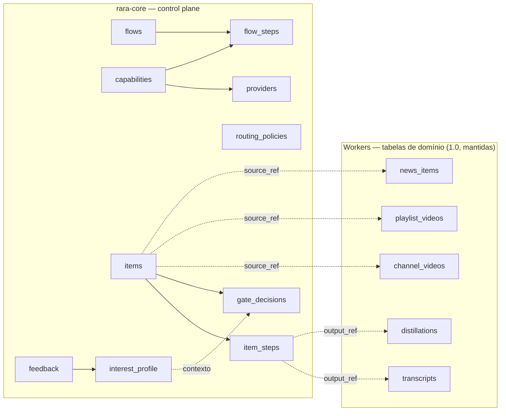
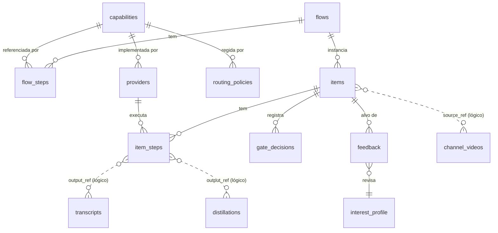
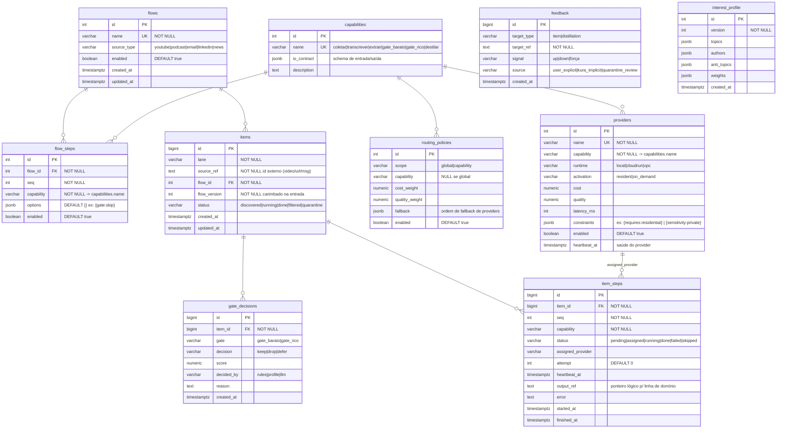
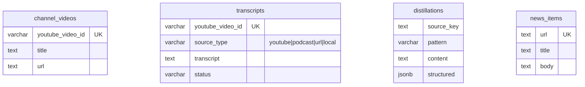

# rara 2.0 — Modelo de dados (Mermaid)

Estrutura de dados do 2.0 em dois níveis: **macro** (famílias de tabelas e como se ligam) e
**detalhado** (todas as colunas das tabelas do `rara-core`). Companheiro do
[ARCHITECTURE-2.0.pt-BR.md](./ARCHITECTURE-2.0.pt-BR.md).

Convenção: linhas **sólidas** = relação dentro do mesmo agente (com FK); linhas **tracejadas** =
link lógico cruzando fronteira de agente (sem FK), como no 1.0.

---

## Nível macro — duas famílias de tabelas

O `rara-core` é dono das tabelas de **controle**; os workers continuam donos das tabelas de
**domínio**. O control plane referencia o domínio só por chave lógica (`source_ref`, `output_ref`).

---

## Nível macro — relacionamentos (ER simplificado)

---

## Nível detalhado — tabelas do rara-core

---

## Nível detalhado — tabelas de domínio (1.0, referência)

Mantidas como estão; o detalhe completo vive em [DATABASE_SCHEMA.md](./DATABASE_SCHEMA.md).
Aqui só os pontos de ancoragem (`output_ref` / `source_ref`).

