# NeonDB — Database Schema

All services share the same NeonDB (PostgreSQL) instance, each with isolated tables prefixed by service domain.

```mermaid
erDiagram

  %% ─── RARA-HARVEST ───────────────────────────────────────────
  target_channels {
    serial        id               PK
    varchar(255)  youtube_channel_id UK "NOT NULL"
    varchar(255)  channel_name        "NOT NULL"
    boolean       active              "DEFAULT TRUE"
    timestamptz   created_at
    timestamptz   updated_at
  }

  channel_videos {
    serial       id               PK
    int          channel_id       FK
    varchar(50)  youtube_video_id UK "NOT NULL"
    text         title               "NOT NULL"
    text         url                 "NOT NULL"
    timestamptz  published_at        "NOT NULL"
    timestamptz  collected_at
  }

  target_channels ||--o{ channel_videos : "has"

  %% ─── RARA-SHELF ─────────────────────────────────────────────
  playlists {
    serial      id                  PK
    varchar(64) youtube_playlist_id UK "NOT NULL"
    text        title                  "NOT NULL"
    text        description
    varchar(20) privacy_status
    int         item_count
    boolean     active                 "DEFAULT TRUE"
    timestamptz created_at
    timestamptz updated_at
  }

  playlist_videos {
    serial      id               PK
    int         playlist_id      FK
    varchar(50) youtube_video_id    "NOT NULL"
    text        title               "DEFAULT ''"
    text        url                 "NOT NULL"
    timestamptz published_at
    int         position
    timestamptz collected_at
  }

  playlists ||--o{ playlist_videos : "contains"

  %% ─── RARA-SCRIBE ─────────────────────────────────────────────
  transcripts {
    serial      id               PK
    varchar(16) source_type         "NOT NULL  youtube|local|url"
    varchar(50) youtube_video_id UK
    text        source_ref          "NOT NULL"
    text        language
    varchar(48) engine              "NOT NULL"
    text        transcript
    int         duration_seconds
    varchar(16) status              "DEFAULT done"
    text        error
    int         attempt_count       "DEFAULT 0"
    timestamptz created_at
    timestamptz updated_at
  }

  transcript_segments {
    serial        id            PK
    int           transcript_id FK
    int           seq              "NOT NULL"
    numeric(10-3) start_seconds    "NOT NULL"
    numeric(10-3) end_seconds      "NOT NULL"
    text          text             "NOT NULL"
  }

  transcripts ||--o{ transcript_segments : "has"

  %% ─── RARA-DISTILL ────────────────────────────────────────────
  distillations {
    serial      id               PK
    varchar(50) youtube_video_id
    varchar(16) source_type         "NOT NULL  youtube|url|local"
    text        source_ref          "NOT NULL"
    text        source_key          "NOT NULL"
    varchar(48) pattern             "NOT NULL"
    varchar(48) context
    varchar(48) strategy
    text        session_patterns
    varchar(48) engine              "NOT NULL"
    text        title
    text        content
    jsonb       structured          "DEFAULT {}"
    varchar(16) structured_status   "DEFAULT ok"
    text        doc_context
    jsonb       metadata
    varchar(64) source_sha256       "NOT NULL"
    varchar(64) recipe_sha256       "NOT NULL"
    varchar(16) status              "DEFAULT done"
    text        error
    int         attempt_count       "DEFAULT 0"
    timestamptz created_at
    timestamptz updated_at
  }

  %% ─── RARA-FEED ───────────────────────────────────────────────
  feed_sources {
    serial      id             PK
    varchar(64) name              "NOT NULL"
    varchar(8)  source_type       "NOT NULL  rss|html|hn"
    text        endpoint          "NOT NULL"
    varchar(24) cls               "NOT NULL"
    varchar(12) fetch_strategy    "DEFAULT http"
    varchar(24) parser
    boolean     enabled           "DEFAULT true"
    timestamptz created_at
  }

  news_items {
    serial      id             PK
    varchar(64) source            "NOT NULL"
    varchar(24) cls               "NOT NULL"
    varchar(8)  source_type       "NOT NULL"
    text        url             UK "NOT NULL"
    text        title
    timestamptz published_at
    text        excerpt
    text        body
    varchar(8)  fetch_status      "DEFAULT excerpt"
    varchar(64) content_sha256    "NOT NULL"
    varchar(8)  status            "DEFAULT ready"
    text        error
    int         attempt_count     "DEFAULT 0"
    timestamptz created_at
    timestamptz updated_at
  }
```



## Cross-service links (logical, not FK)

| From | Column | To | Column | Usage |
|---|---|---|---|---|
| `channel_videos` | `youtube_video_id` | `transcripts` | `youtube_video_id` | scribe picks up videos to transcribe |
| `transcripts` | `youtube_video_id` | `distillations` | `youtube_video_id` | distill reads transcript for a video |
| `playlist_videos` | `youtube_video_id` | `transcripts` | `youtube_video_id` | shelf-sourced videos also flow to scribe |
| `news_items` | `url` | `distillations` | `source_ref` | feed items flow to distill via source_ref |

> **Note:** these are application-level joins — no FK constraints cross service boundaries.

## Unique constraints & dedup keys

| Table | Unique constraint | Purpose |
|---|---|---|
| `target_channels` | `youtube_channel_id` | one row per channel |
| `channel_videos` | `youtube_video_id` | global video dedup |
| `playlists` | `youtube_playlist_id` | one row per playlist |
| `playlist_videos` | `(playlist_id, youtube_video_id)` | same video can be in N playlists |
| `transcripts` | `youtube_video_id` | one transcript per video |
| `transcript_segments` | `(transcript_id, seq)` | ordered segments |
| `distillations` | `(source_key, COALESCE(session_patterns, pattern))` | one distillation per recipe+source |
| `feed_sources` | `(name, endpoint)` | no duplicate sources |
| `news_items` | `url` | one item per URL |
```
