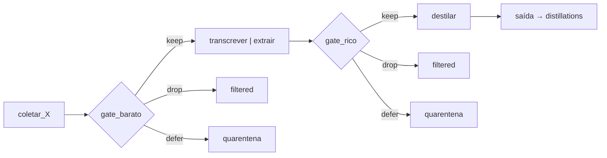
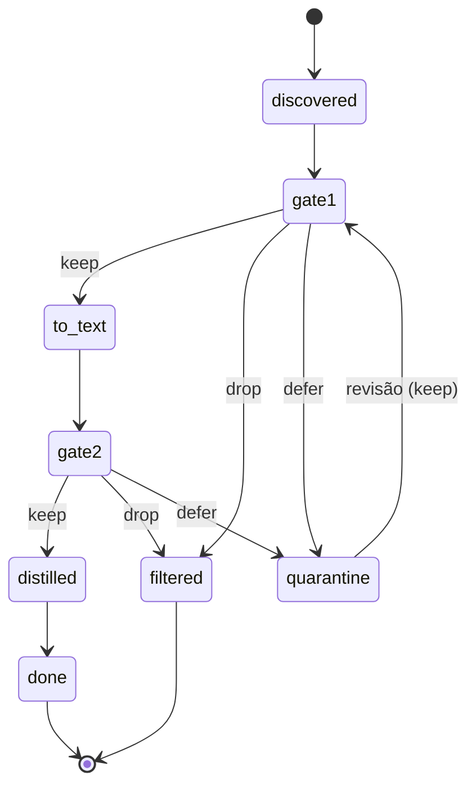
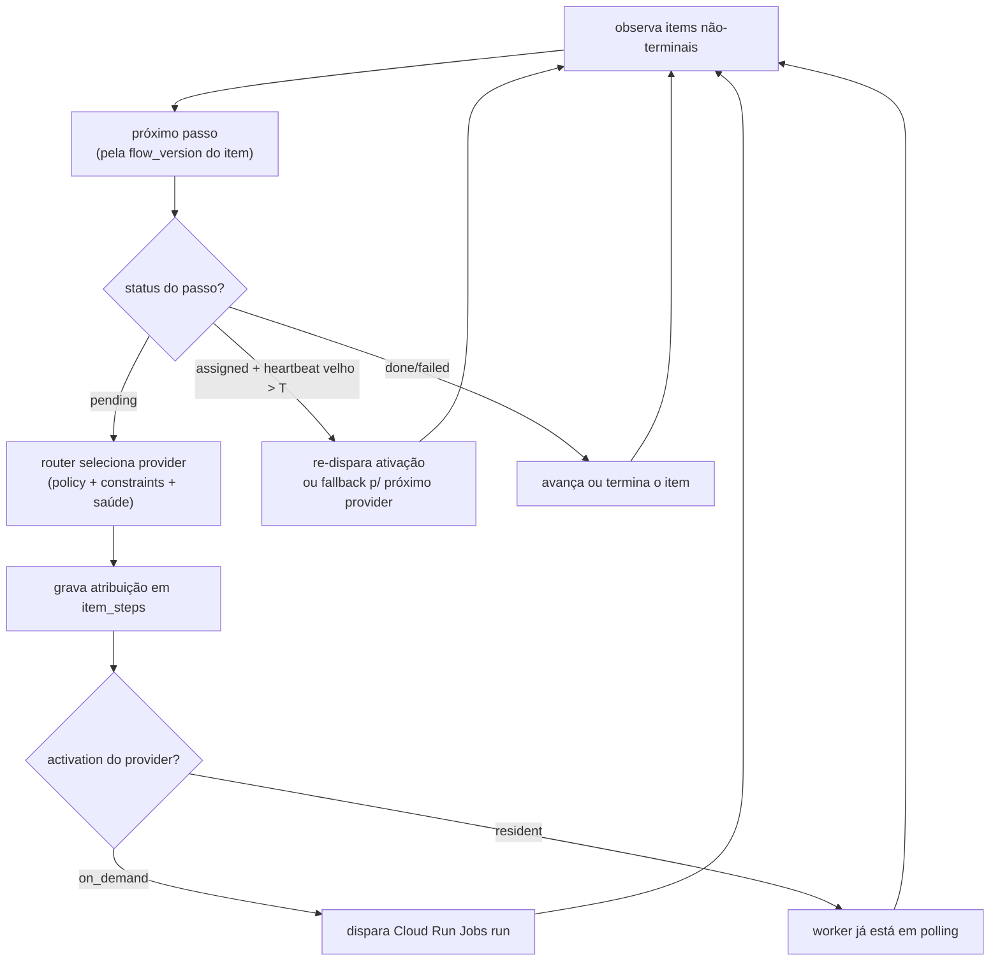
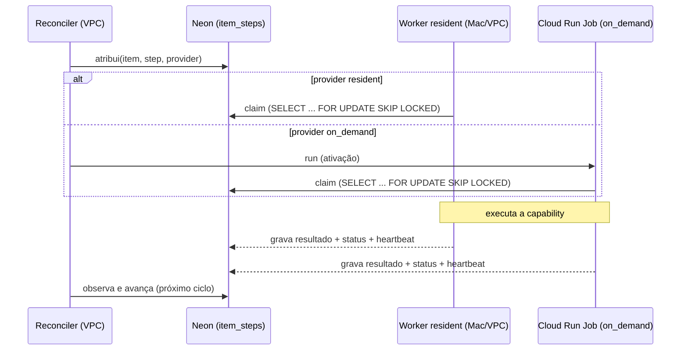
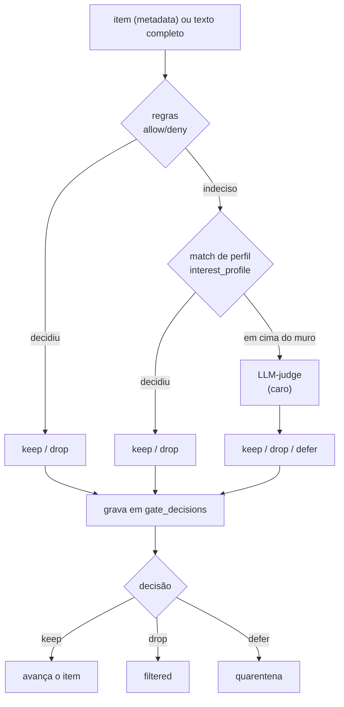
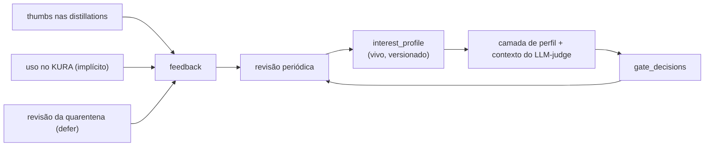
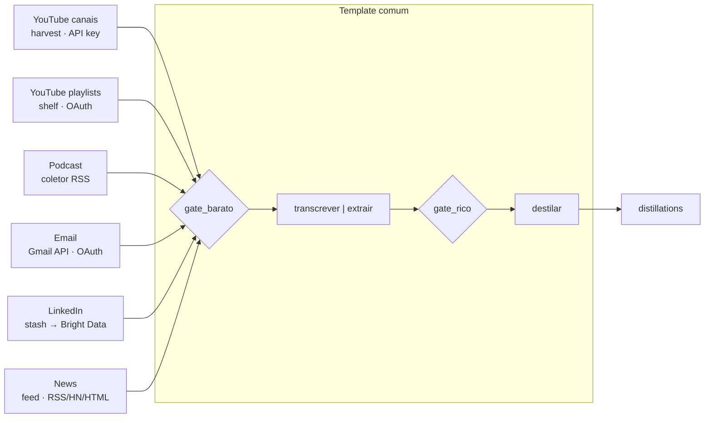
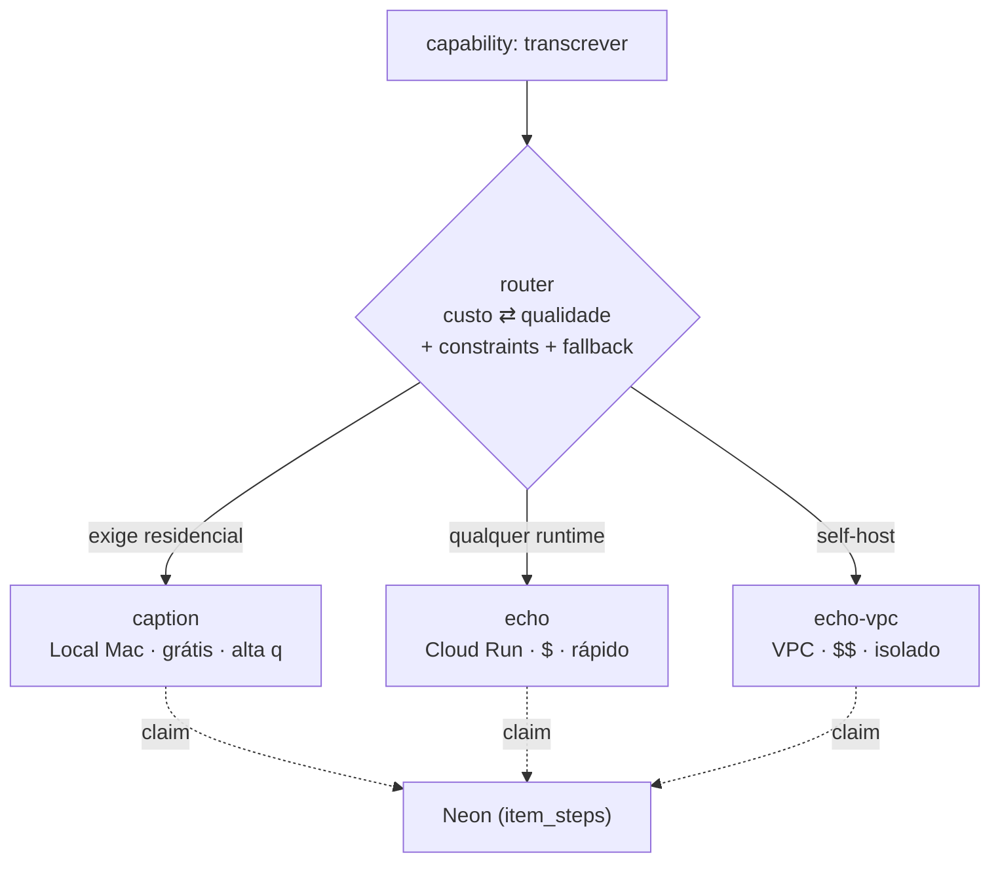

# rara 2.0 — Fluxos das funcionalidades (Mermaid)

Todos os fluxos do 2.0: o pipeline universal, a máquina de estados do item, o loop do reconciler,
o despacho (pull + ativação), os portões em cascata, o loop de aprendizado, as raias de fonte e o
roteamento de provider. Companheiro do [ARCHITECTURE-2.0.pt-BR.md](./ARCHITECTURE-2.0.pt-BR.md).

---

## 1. Pipeline universal

Toda raia colapsa neste template; os toggles do flow podem pular passos.

---

## 2. Ciclo de vida do item (máquina de estados)

---

## 3. Loop do reconciler (control plane)

Level-triggered: observa estado desejado vs atual e age. Roda always-on na VPC.

---

## 4. Despacho — pull pro trabalho, ativação configurável

Entrega de trabalho é sempre **pull**; só a forma de **acordar** o worker muda.

---

## 5. Portões de curadoria — cascata barato→caro

A camada cara (LLM) só roda no que ficou em cima do muro.

---

## 6. Loop de aprendizado (feedback → perfil → próximas decisões)

Loop fechado por um artefato legível por humanos; sem infra de treino.

---

## 7. Raias de fonte → template comum

Cada raia muda só o coletor e o passo de virar texto; o resto é compartilhado.

---

## 8. Roteamento de provider (uma capability, vários runtimes)

O router ordena por custo ou qualidade e respeita constraints duras.

