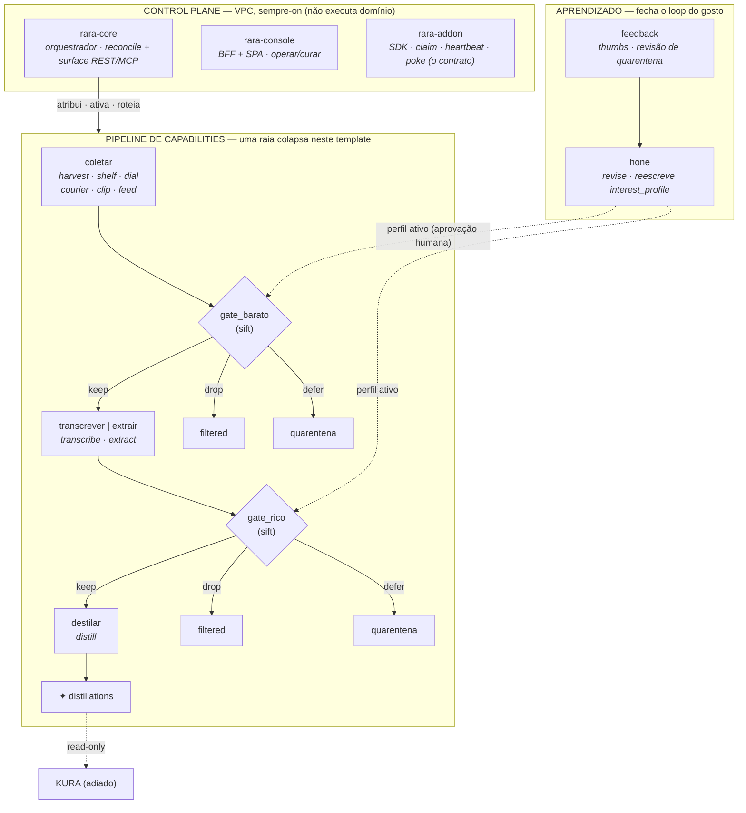
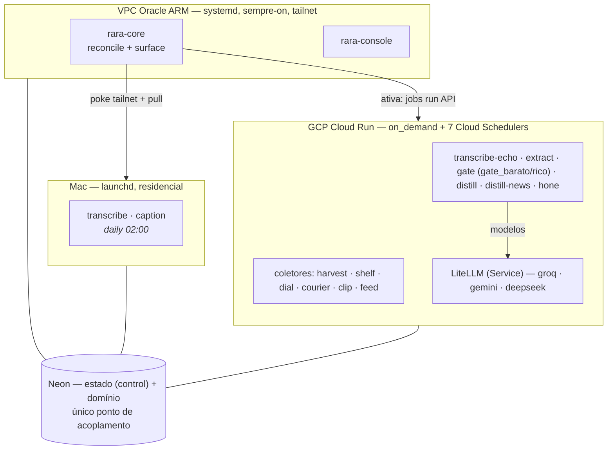
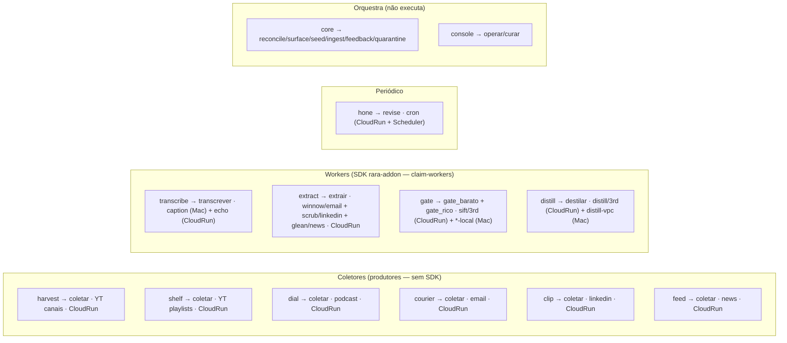

# rara 2.0 — As peças (Mermaid)

Visão **macro das peças** do ecossistema, como estão hoje: os apps, a capability que cada um serve,
e onde rodam. Tela para repensar a arquitetura de peças. Companheiro do
[ARCHITECTURE-2.0.pt-BR.md](./ARCHITECTURE-2.0.pt-BR.md); fluxos detalhados em
[FLOWS.mermaid.md](./FLOWS.mermaid.md); dados em [DATA-MODEL.mermaid.md](./DATA-MODEL.mermaid.md).

Regra de ouro: **o contrato é a tabela no Neon, nunca a chamada direta.** O `core` decide; as peças
executam; ninguém chama ninguém.

---

## 1. As peças por papel + o pipeline

---

## 2. Onde cada peça roda (instalação atual)

Regra de host: **always-on → VPC (systemd); on_demand → Cloud Run Jobs; áudio YouTube → Mac**
(IP residencial). Um app serve vários providers por config (codebases ≪ providers).

---

## 3. Mapa app → capability → providers → host

